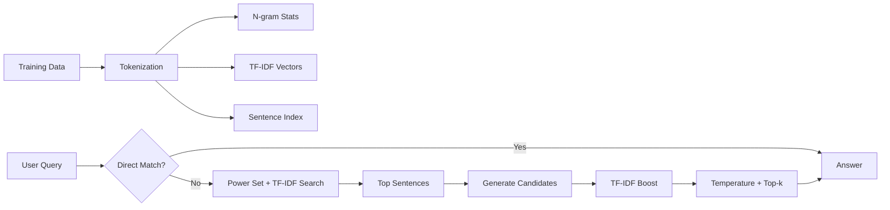

# NarrowMind

**A lightweight statistical language model for question-answering and text generation.**

NarrowMind combines statistical n-gram modeling with modern language modeling techniques (temperature sampling, top-k sampling, TF-IDF) to provide fast, memory-efficient language understanding without neural networks.

## Features

- **Question Answering**: Understands questions with wildcards (who, what, where, when, why, how)
- **Text Generation**: Generates contextually relevant continuations
- **Multi-gram Ensemble**: Weighted combination of bigrams and trigrams
- **TF-IDF Semantic Search**: Finds semantically similar content
- **Temperature & Top-k Sampling**: Same concepts as GPT for controlled randomness

## Quick Start

1. Place your training text in `input.txt`
2. Run `cargo run`
3. Ask questions using question words as wildcards:
   ```
   > who was getting ready
   > what did mia realize
   > quit
   ```

## How It Works



**Algorithm Order:**
1. **Direct Pattern Matching** - Fast exact text search
2. **Power Set Matching** - Finds sentences matching word combinations
3. **TF-IDF Similarity** - Semantic vector search (fallback)
4. **Multi-gram Ensemble** - Combines bigrams & trigrams with weights
5. **TF-IDF Relevance Boost** - 1.0-3.5x multiplier for contextually relevant words
6. **Temperature & Top-k Sampling** - Controlled randomness

## Example

```
Training: "Mia was getting ready for school. She realized she forgot her homework."

Query: "who was getting ready"
Response: "Mia was getting ready for school."
```

## Configuration

```rust
let mut model = LanguageModel::new(3);
model.set_temperature(0.8);  // Lower = more deterministic
model.set_top_k(20);         // Limit to top 20 candidates
model.train(&training_data);
```

## Requirements

- Rust 1.70+
- Training data in `input.txt`
- Dependencies: `rand` crate only

## Comparison with GPT

| Feature | NarrowMind | GPT |
|---------|-----------|-----|
| Architecture | Statistical n-grams | Neural network |
| Memory | ~MBs | ~GBs to TBs |
| Speed | Instant | Slower |
| GPU Required | No | Yes |
| Temperature/Top-k | ✅ Yes | ✅ Yes |
| Semantic Search | ✅ TF-IDF | ✅ Embeddings |

---

**NarrowMind**: Think small, understand deeply. 🧠
